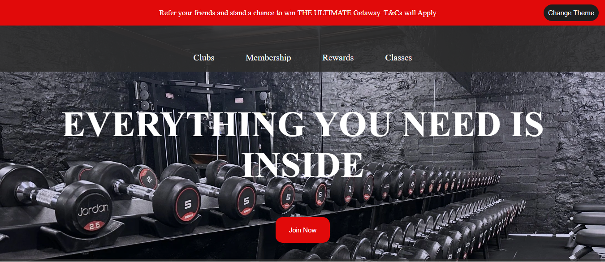
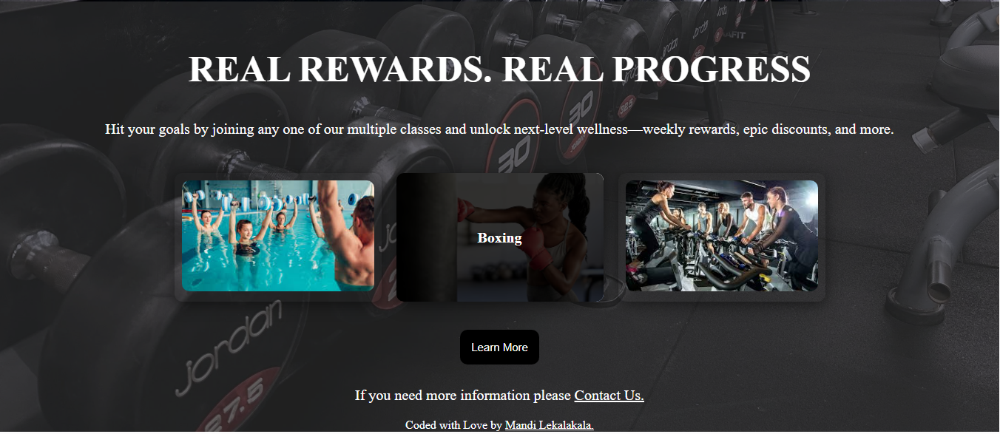
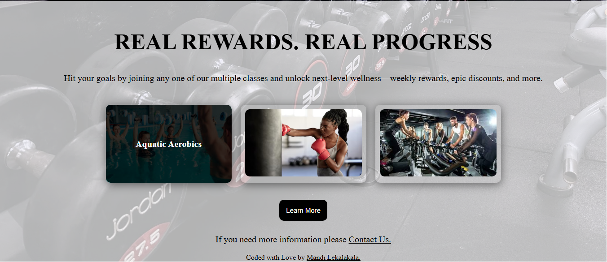

🏋️ Fitness Club Landing Page (UI Practice)
 

⚠️ This project cannot be hosted publicly due to licensing and usage restrictions.

 
📖 Project Overview
 

This project is a responsive fitness club landing page built early in my front-end journey to practice layout, styling, and user interaction. The design was inspired by a well-known South African fitness brand and focuses on recreating a clean, modern interface commonly used in fitness and lifestyle websites.
The project was created to strengthen my understanding of CSS layout techniques and JavaScript-driven interactivity in a real-world style layout.

🛠️ Technologies Used:
<ul>
<li>HTML</li>
<li>CSS (Flexbox)</li>
<li>JavaScript</li>
</ul>
✨ Key Features:
<ul>
<li>Fully responsive landing page layout</li>
<li>Flexbox-based structure for clean and adaptable design</li>
<li>Dark mode toggle functionality</li>
<li>Modern UI styling inspired by commercial fitness websites</li>
</ul>
🧠 What I Applied & Learned:
<ul>
<li>Building responsive layouts using Flexbox</li>
<li>Implementing JavaScript for UI interactions such as toggles</li>
<li>Creating and managing a dark mode feature</li>
<li>Improving problem-solving through layout and styling challenges</li>
<li>Writing more structured and maintainable CSS</li>
</ul>

📌 Notes
This project was built for learning and practice purposes. It is not affiliated with, endorsed by, or intended to replicate any official brand or commercial website.

📸 Project Preview:

  
  
  

