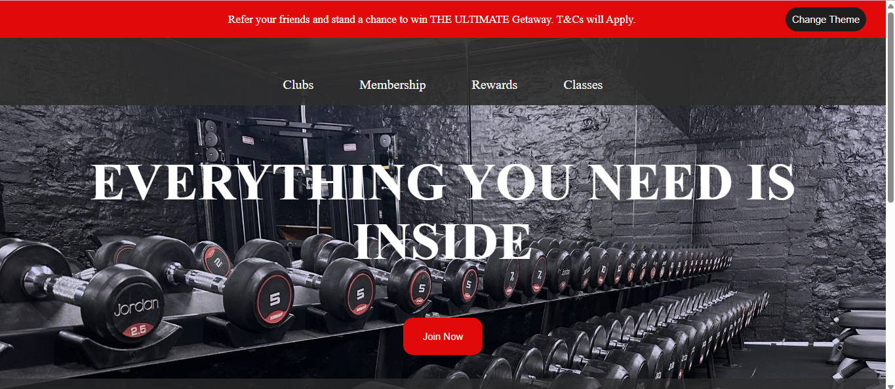
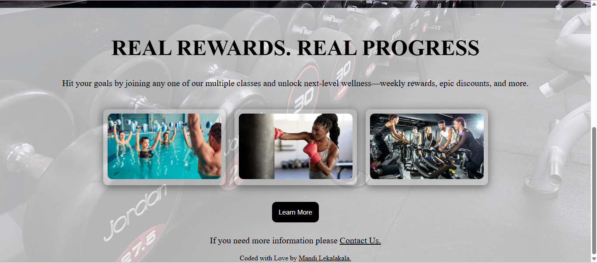
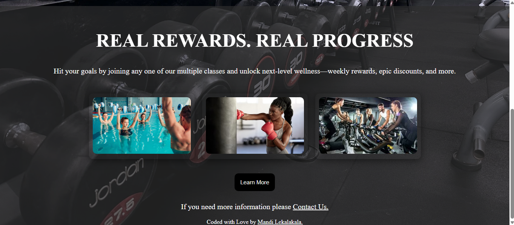

# Gym Fitness Landing Page

A modern, responsive fitness landing page built to showcase gym services, membership plans, and compelling call-to-action sections. This project demonstrates clean layout structure, professional UI implementation using core frontend technologies.

---

## Tech Stack

- HTML5
- CSS3
- CSS Flexbox
- JavaScript
- Responsive Design

---

## Key Features

- Hero section with a structured layout and clear call-to-action
- Services and membership plan sections
- Fully responsive across all screen sizes
- Hover effects and interactive UI styling
- Semantic, well-organized HTML structure
- Dark Mode/Light Mode toglle button

---

## Project Objective

This project was built to strengthen my understanding of responsive layout design, Dark Mode to Light Mode intergration and Flexbox positioning. It demonstrates my ability to build structured, scalable landing pages that adapt across devices while maintaining a clean and professional UI.

---

## Homepage

---

## Light Mode

---

## Dark Mode

